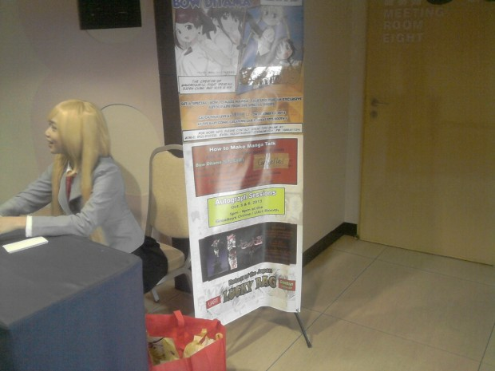
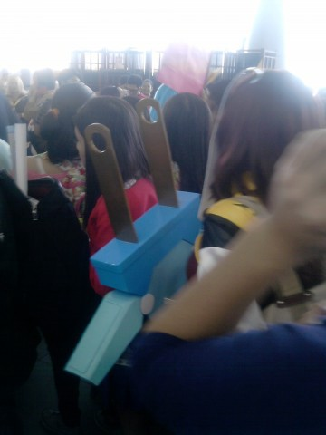
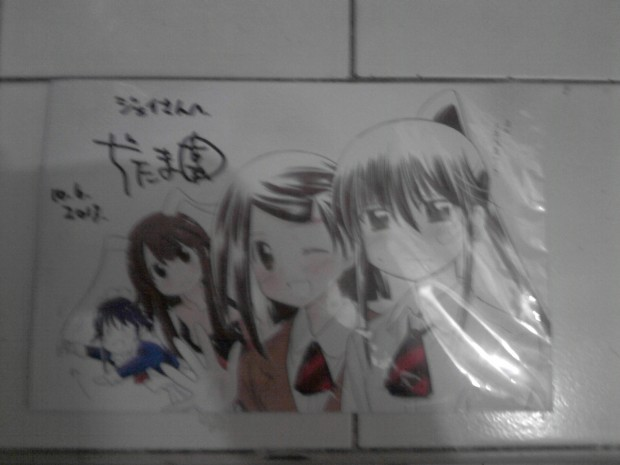

_**Note (September 21, 2021):** This feature is originally published on [Deremoe](/deremoe) in October 2013. In commemoration of the ending of KissxSis manga, I've updated this story heavily, but I make sure the context is somehow the same. Enjoy reading!_

We are fortunate to have a mangaka to reach our shores. The **Japan Artist Talks** presented by UART Comic Creators Lab in partnership with Great Toys Online at Cosplay Mania 2013, features manga artist Bow Ditama, the mind behind [_Mahoromatic_](http://en.wikipedia.org/wiki/Mahoromatic), [_Kiss x Sis_](http://en.wikipedia.org/wiki/Kiss_x_Sis) and [_Fight Ippatsu! Juuden -chan!!_](http://en.wikipedia.org/wiki/Fight_Ippatsu!_J%C5%ABden-chan!!).

The event has four segments: “Talk live,” “Talk with the artist,” the “Lucky Draw” and the Autograph Session. The artist behind _Kill me Baby_, Kaduho, was supposed to join him but is unable to attend the said talk due to personal reasons.

## Bow Ditama's Beginnings

The first part of the talk is about Bow Ditama-sensei’s beginnings — he got his first published work in **Dolphin Comics** in 1994; but before that, he made doujinshi (independent works) way back the 90’s, when he was 21 years old.

In his childhood, he spends time on reading manga and playing soccer (he’s in defense), but he prefers reading manga more — and as he remember, the first manga he has read was _Doraemon_. We’ve had guests from Japan say that (include Starmarie and Joe Inoue), which made me a bit curious about the said manga’s popularity and influence. After all, we happen to know the robot cat first when we saw him on local TV.

The most impressive manga he has read is comedy manga [_Patalliro!_](http://en.wikipedia.org/wiki/Patalliro!), which almost made the audience go nuts.

Moving on to his steps on becoming a pro manga artist, he also mentioned that he first aspired to become an animator — he has even worked in the said industry as well — and knowing the hardships of being in the anime industry, he decides to proceed making manga, since he’s confident that he will be able to do it well.

The journey to be a pro mangaka went well for Bow Ditama-sensei, as he has connections in the manga industry. It took him three to four years to be one. He added that there are manga artists who can debut in just a year, or in 10 years’ time, so we can say that he made it in a short span of time.

When asked what did he felt after he had his work published, he responded that he feels embarrassed; because his work will be seen by the manga-reading audience.

## Kiss x Sis

We then proceed on talking about his work **Kiss x Sis**, and this time we had a publisher by the name of **Nishii-san** with him.

_Kiss x Sis_ started with a story, and the character concept that will fit it. From what we have heard, bow Ditama-sensei visualized the “sister character” in this work.

He revealed that _Kiss x Sis_ was supposed to be a one-shot manga at first. He also mentioned a thing or two about fanservice and the sexy character image embedded in the series — he’ll add it if it really fits, otherwise he’ll pull it off. Ecchi is in-demand, he said. “Everyone likes ecchi, right?”

In case of **Juden-chan** and **Mahoromatic**, does he visualize characters that can be Cosplayed? Bow Ditama-sensei said yes — and just to let you know, we’ve had a Cosplayer donning Juden-chan joining the audience.

So, what was his technique as a pro manga artist? He starts practice by creating a character and drawing it. He pointed out his most important thing as a professional manga artist — “we need to make moves to reach our dreams,” he said.

Lastly, he asked for the support of the audience — “\[…\] please support him more and more from now on,” the host said.

## Q&A with Bow Ditama-sensei:

The second part of the talk was the most amusing part of the program — the **“Talk with the Artist”** segment is a Q&A session where the audience can ask questions. Here’s a summary of what has been asked:

- **Do you still improve your skills?** Aside from reading more manga, he has to practice to compare his other works in order to see the mistakes he needs to correct.
- **Are there any tips in being a mangaka?** “There are differences in Japan and the Philippines, but if you don’t strive to move, nothing will happen.”
- **Are you satisfied with the anime adaptation of Kiss x Sis?** Yes.
- **If you are given a chance to write another series, what genre would it be?** He has a variety of genres, but he’s thinking of what it would be next — and actually, he has another project to do.
- He gets inspired by **watching movies**.
- His current favorite work is **Akina**. We’re not sure if that’s an anime character, an anime series or a manga though, but they mentioned its author so it should be available in Japan.
- His favorite genre is **Romantic Comedy** (Rom-Com, or Love-Come if you prefer).
- **Is the English release for Kiss x Sis possible?** Even if he wants to, it’s in the publisher’s discretion. He was asked if there will be an American release (through _Viz_, _Seven Seas_, etc.) but the question was misunderstood a bit, thinking that if there would be a Philippine release of the said manga. The publisher’s answer is this: “If they want to have Kiss x Sis in the Philippines, please do action.”
- **Will there be a second release of the Kiss x Sis manga?** We’ve only understand some parts of the answer, but Bow Ditama-sensei mentioned that Juden-chan will end soon.
- **Special techniques? Why there are no nipples in the breasts of the characters?** This is as far as yours truly can remember during that time — The emcees actually showed examples to him so he can answer the question well, and he said that _it’s in what way the artist draws_.
- **What an aspiring mangaka should focus from the start?** Make something that will appeal to the Japanese market. Knowing the Japanese language is a plus.
- **What’s his opinion in doujins of his works?** It’s okay for him, but it will depend on the publisher if they will be chased.

The last two parts are the Lucky Draw and the Autograph Session, wherein they gave away boxes of Beef Curry from Japan. We can say that it’s in powder form, but we are not really sure about that. Either way, it’s beef curry, and I'm sure that [Al](https://www.youtube.com/watch?v=k9ius8M7Y5U) would love to have that.

They also gave away manga drawing kits, but the luckiest one has been given a free art commission on the spot, by Bow Ditama-sensei himself. The autograph session, he writes the names of the audiences in Katakana, which makes the experience much more memorable.

Shortly before the event ended, we approached Mr. Malvin Lim of Great Toys Online about the session. Notice that what was supposed to be the 1PM session was moved into a joint session by 3PM, and almost two-thirds of the meeting room were occupied. He told us that this could affect the succeeding talks that they might do in the future, but I see a silver lining amid all these.

We’ve asked an attendee by the name of _Moonlight Bomber_ [**Benedict Villariaza**](http://jollysword.livejournal.com/) before the start of the program on what he feels about the said event, and he’s happy with it, giving hopes that this trend of inviting Japanese artists will continue.

I share his sentiments, noting that among all the guests in Cosplay Mania 2013, Bow Ditama-sensei and cosplayer **Goldy** are the most anticipated guests during Cosplay Mania in 2013.

We thank Mr. Malvin Lim of [**GreatToysOnline.com**](https://shop.greattoysonline.com/) and the guys at **UART Comic Creators Lab** for having this worthwhile occasion. We hope that we will have another set of Japan Artist Talks soon.
