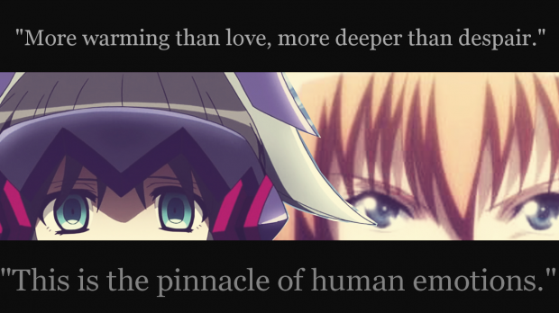

I’ve just finished watching the latest episode of **Sekatsuyo** (aka “\[I\] _Wanna be the Strongest in the World!_“), and I’ve no regrets in dropping this show, even if my colleagues on the Shota and the Raging Teenage Hormones Departments disagree with me. It’s not just a wrestling anime, and I’m not into fanservice as well — what I’ve got interested in watching this series is the plot.

How could someone in an idol group cope with all the trauma she had when her best friend decides to go full-time into wrestling, leaving her alone? How does an idol group move on from the fact that their Center Nova gets out to move to a different spotlight? It took us eight episodes before reaching the answer, and man, I’ve never expected their plot twist — I was ready for that to happen, but oh my God, the execution was unexpectably good.

My body was not ready for that cliffhanger though. After seeing that, I went ecstatic. “I may not slep well again this time,” I say to myself.

Since episodes are released either Sunday or Monday, I still have to wait for a week to crunch out the feelings of hype the series injected to me.

I can only think of possible outcomes as the series ends: (1) Sakura Hagiwara continues her wrestling career full-time, (2) Sakura Hagiwara is joined by a fellow idol in her wrestling career (might not be possible), (3) Sakura Hagiwara will juggle two roles as a pro wrestler and as a national idol, or (4) Sakura Hagiwara retires from the entertainment industry (which is obviously impossible).

But you know, I felt deja vu again — this has happened to me for the fourth time.

Symphogear G. The third Madoka Magica movie… and now, this wrestling anime. Being emotional, I find some plots in these series either utterly disappointing sometimes but most of them left an indelible mark in my anime-viewing experience.

All of them had their respective characters — the protagonist’s best friends — stuck in their beliefs that their friendship will stay forever. FOREVER. They just can’t accept that their best friends and themselves will separate soon enough — and that’s how the Tanoshii train goes.

Whether it’s because of beliefs or commitments, when a best friend needs her best friend THAT badly, the Tanoshii trains goes full speed. No eject button, no brakes, until the conflict gets a resolve.

We can’t prevent the Tanoshii train — it’s human nature. Then again, people can’t accept bad things that easily, so we’re in for some cringing plot filled with passion of feels. What we can do is watch until the end — because everything has a resolve, and unlike Madoka Magica, everything ends on a happy note.

On another note — based on my experience, when **Asumi Kana** portrays a happy character, it’s very okay with me, but when she portrays a sad character, I feel very, very, very, very very depressed. Mix that with the illustrations and, boom, there goes my fluttering heart. I believe she’s playing with our emotions at that state. So sad.

If this is what you feel as well, share it with me and let’s re-feel our feels.
