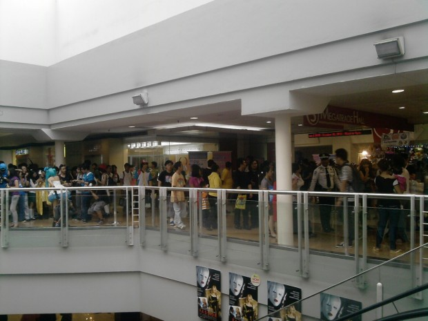
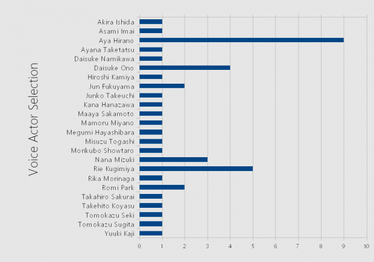

We are continuing our set of what is now the “We Asked You” segment on the site with this one that was held at **Oh-no! Manga Octo-Con 2**.

As I have told you before in our list of 15 Japanese Voice Actors we would like to meet and greet with in the Philippines, there is a growing trend of Japanese artists coming to Manila for meet-and-greet sessions, and we would like to continue the trend.

History states that _Ozine Fest 2013_ have hinted at bringing here a Japanese voice actor by next year with their move to SMX Manila, and they even promised it before at Otaku Expo sometime in the last two quarters of 2012.

“We would like to have these kinds of meetups here”, and apparently we’re not just the ones saying this.

In a survey conducted around the afternoon of Sunday, October 20, outside Megatrade Hall 3 of SM Megamall; with 17 respondents (the target was supposed to be 20) and an estimated two to three percent (2–3%) error rate, here are the results.

#### The Basics

Most of the respondents are Cosplayers (9 respondents, 53%) and the rest are 47% (8 respondents), and majority of the respondents are aged 17.

#### The Questions

- _Q1. Are you aware of Japanese Voice Actors (Seiyuu)?_ Sixteen (16) out of seventeen people in this survey said **yes**.
- _Q2. Can you give at give at east three seiyuu you can remember the most?_ **Nine (9) respondents provided at least three as instructed**, while six (6) gave less than three, and one gave more than three voice actors that they can remember the most.
- _Q3. Where do you get the latest news about them?_ Most of them (11 respondents) said **they get it online** (Google, Facebook, Sankaku Complex, Anime News Network), while the rest get it from either friends or magazines (like Otakuzine). Two of them said they get it from other people, and two of them answered none.
- _Q4. Are you interested in having them here in the country?_ **All of the respondents said Yes**, with answers ranging from “80% interested”, “of course” and one even said “Hell Yeah”.

I’m also surprised that Aya Hirano is the voice actress most respondents remember the most, followed by Rie Kugimiya, Daisuke Ono and Nana Mizuki.

**If we are to base our decision from this short survey alone**, the organizers should make their first moves in getting a voice actor in the country, regardless if it’s on major or minor events. As soon as possible, if you may.

With all of that said, we affirm our request for Japanese voice actors to have meet-and-greets here in the country. We here at Deremoe will be monitoring, waiting and hoping for any organizer in the country to get connections with voice talent agencies in Japan by the next four to five years — and we hope you’re with us as well.
