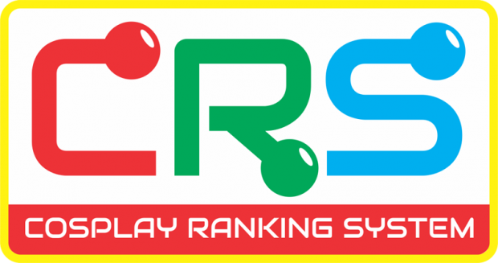

Days ago, Cosplay.ph [announced the creation of their Cosplay Ranking System](https://web.archive.org/web/20170202170044/http://cosplay.ph/2013/02/cosplay-ranking-system-crs/), in which the participants in Cosplay.ph-organized masquerades will be ranked according to their skill and experience.

In this post, Deremoe will observe the developments in regards to this new system that is said to be based on international guidelines from its announcement to its formal launch and implementation at the 6th Philippine Cosplay Convention this March at Robinsons Place Manila.

#### CRS in the community’s perspective

The objective of CRS is to motivate those who are new to the Cosplay community to enjoy it. Unfortunately, the announcement was welcomed with negative reactions and skepticism — bad reactions from the community sprouted throughout the next few days. These include reactions from Mike Abundo, a staunch detractor of the organization.

> _“First, they trademark the art, then they mark the artists.”_ 
> 
> Mike Abundo, on [a comment](http://www.facebook.com/story.php?story_fbid=573519422678003&id=118866964809920&refid=17&_ft_=fbid.573519422678003) posted at Deremoe’s Facebook page.

Aside from Abundo’s comments, a Facebook user brought up the issue, saying:

> _\[…\] Let’s say a really awesome cosplayer (like me, ahahaha /gets shot) hasn’t joined a contest before nor registered. Thus, he/she would get dumped into the beginner rank. Wouldn’t he/she be an overkill, which would defeat the purpose of giving newbs a chance to win?_
> 
> _SnowfallSlasher, on_ [_her personal Facebook_](https://m.facebook.com/story.php?story_fbid=290311907763328&id=1456174702&_rdr)_._

#### CRS in the organizers’ perspective

In regards to the announcement, Deremoe was able to speak with the head of Cosplay.ph, Pablo Bairan.

**Q**: When this system is being planned, what is the organization’s mindset when they started creating it?  
**Bairan**: The goal of the CRS is to help group cosplayers of the same caliber together, and to encourage beginners to try their hand at competitions without the fear of not getting a prize or recognition for their efforts simply because the field of competition is dominated by more experienced cosplayers. Beginners will also be able to climb through the ranks, providing them extra motivation and giving them the drive to improve their Cosplay skills without being overshadowed by much more experienced competitors.

**Q**: Aside from implementing the system in events organized by Cosplay.ph, is there any chance that it will be implemented in events outside Cosplay.ph’s reach?  
**Bairan**: There is accreditation for events outside those of Cosplay.ph, although we would first have to study the competition first to ensure that the standards are up to par with other CRS Contests. We will never impose this accreditation on other events, however.

**Q**: What do you think of the system five years from now?  
**Bairan**: In the next five years, there will likely be a more even distribution of Beginners, Intermediate and Veteran competitors. Likely, there will be competitions for all 3 Ranks in the same event with the appropriate prizes and recognition based on each Rank. Competition will be fiercer in the higher ranks and more casual in the lower ranks. Veteran rank Cosplayers will also tend to help out Beginner Cosplayers more also since they will not be competing with them in the same contest.

#### CRS in contrast to International Guidelines

As stated earlier, this is said to be based on the guidelines set up by the International Costumers Guild, with the similar aim of providing fair play — but in contrast to the CRS, they have a clause, as writen:

> _There is no committee or organization that tracks all costumers’ wins for placement purposes. It’s not practical or even possible. There are just too many competitions happening around the world. An entrant’s placement in any division is based on a combination of the honor system and the discretion of the Masquerade director._
> 
> ICG Guidelines: Ensuring Fair Competition_,_ [_http://www.costume.org/documents/fairness.html_](http://www.costume.org/documents/fairness.html)_, visited 11 February 2013_

#### Is the best yet to come?

With the start of the Cosplay Ranking System, will the Cosplay community be better, or it will go to its dark ages as being predicted by some people? In my honest opinion, this might spark arrogance among Cosplayers, and it might lead to arguments for bragging rights. On a second thought, this can motivate newcomers to be competitive. Either way, we are still unsure of what will happen next — and we’ll wait for updates from our end and document it for you, that’s for sure.
