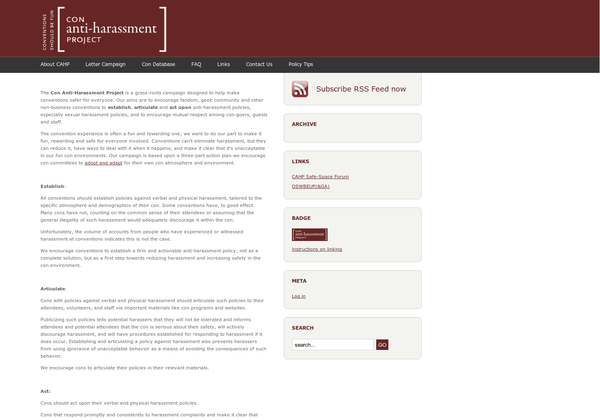

Good day, fellow earthlings. It is inevitable that at every convention in your neck of the woods, you might see a person harrassing someone without the victim knowing it. These mostly consists of pervographers pointing their lens on some girl’s butt or chest, perverts holding such parts without the victim’s consent, etc.

These does not only happen to our neck of the woods, but also in other countries. An article published at LA Weekly addressed this issue and with it included specific examples of people getting harrassed inside the four corners of the convention hall.

As I have read through the article, I followed one Aussie cosplayer responsible for making a guide on how not to be a creep inside cons, I visited the sites exhibited (one of them is a bit awful to read) and I stumbled upon this thing called the [Con Anti-Harrassment Project](https://web.archive.org/web/20110902091253/http://www.cahp.girl-wonder.org/). That’s the time when I got an idea that might help attendees like me feel secure — ask the organizers if they have implemented an Anti-Harrassment Policy in their guidelines.

Just a few hours ago, I already sent an email to the CAHP to include three major conventions in their database: TOYCON, Cosplay Mania and Ozine Fest as an action of participation to this endeavor. I also sent emails to the organizers of the aforementioned events inquiring about their Anti-Harrassment Policies. Not to mention that I will send an email to our affiliate Anime Alliance, which is actually helping our country to have a representation in the World Cosplay Summit, as of this writing.

Now, what’s the quick gist of having this policy:

1. Pervographers should be warned.
2. Perverts should be warned.
3. Pervographers and Perverts shouldn’t be inside the event premises.
4. Attendees (regardless if they are Cosplayers or not) should feel safe, and be safe. If the event has security policies, they can add this one to their rules

We attendees would like to have fun — and with this policy at hand, I aim for a fun experience inside the event.
