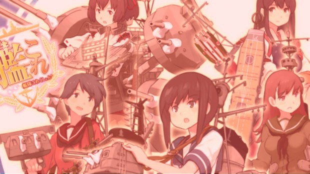

This is yet another trend that I’m looking each time I check out one of my friends’ tweets — **Kantai Collection**, shortened to KanColle. At first, it looks like _Girls und Panzer_ to me, with the girls as the Panzers; but then I found out there’s more to that.

That is when I decided to check out what the madness this is — and based on what I can see on my end, it looks like there are similarities between this so-called “social card game” in Japan and League of Legends in the Philippines: Both of the servers gets crowded because of the players.

Unlike LoL, it seems that KanColle doesn’t have queuing, although it limits its user base to people in Japan only — and if you try to visit their website, you get redirected to somewhere else.

The story about this game, based from what I’ve understand, is that it features moe anthropomorphs of naval warships from the World War II called the “fleet girls” (Kantai Musume, _kanmusu_). In this game, you are the Admiral (_teitoku_) and you play with these girls as a team. This scenario might ring a bell to those who watch or read Arpeggio of Blue Steel: Ars Nova, but it certainly is another thing.

https://www.youtube.com/watch?v=hymxFLmeYck

As of today, [its article on Wikipedia](http://en.wikipedia.org/wiki/Kantai_Collection) features nineteen (19) voice actresses who voiced more than a hundred characters in the said game, and it’s even listed as incomplete, so there’s more to come, I guess.

One of its notable characters was **Shimakaze**, a Japanese destroyer (voiced by _Ayane Sakura_, aka Akane Isshiki of Vividred Operation). We see her here as a cute loli pettanko here, but [history says](http://en.wikipedia.org/wiki/Japanese_destroyer_Shimakaze_%281942%29) “she died” in November 1944 and “her remains” are near Cebu.

I’ve skimmed on what people say about this game, and I’ve seen different viewpoints about this.

> _Kancolle quickly gained players across Japan and has now reached nearly 1 million sigups (sic). It’s said that one of the reasons why it became so popular is because it doesn’t require the player to spend their life savings on it like with other social games_. 
> 
> **_Danny Choo_**_, on_ [_his KanColle feature_](https://web.archive.org/web/20180612210537/http://www.dannychoo.com/en/post/27073/Kantai+Collection.html)

It’s not just people over there who got the hype — even Kotaku’s Australia side has a feature as well. Here’s what writer Toshi Nakamura says about it:

> _\[…\] But, it turns out, one of the game’s biggest benefits is actually in much of its automation and how activities like building and repairing take real time to complete. It allows you to run the game in the background while you do other things and keeps you checking in every now and then for whatever manual micromanagement you want to do._
> 
> **_Toshi Nakamura_**_, Kotaku Australia (_[_article_](http://www.kotaku.com.au/2013/07/japans-latest-popular-online-game-has-anthropomorphic-battleships/)_)_

It was even stated in the article that tweets about KanColle and military stuff are spewing up on Twitter, it’s being mistaken for propaganda. In addition, an editorial by the South Korean newspaper _Hankook Ilbo_ says that “the game majestifies the wartime [Imperial Japanese Navy](http://en.wikipedia.org/wiki/Imperial_Japanese_Navy),” something that WWII victims can’t accept. There’s a reason why we had [Hukbalahap](http://en.wikipedia.org/wiki/Hukbalahap) in the country in the post-war era.

With all the hype it has (near-million signups; [its dedicated Wikia page](http://kancolle.wikia.com/) with information on maintenance routines; [plans for an upcoming anime and a manga release](http://www.animenewsnetwork.com/news/2013-09-26/kantai-collection-moe-card-battle-game-gets-anime-new-manga); a PlayStation Vita version; and yes, a lot of doujin works at the previous Comic Market), **Kantai Collection** was able to hit the Japanese public. If we are to base what Danny said, it’s like those free-to-play games I usually see here; and to add to that, it’s being done in the browser (and it’s in Adobe Flash — thanks to @[Zeroblade](http://twitter.com/zeroblade) on Twitter for the tip.).

On the other hand, one might take this game as another World War II propaganda so I can easily predict that it might not hit well if it opens to other countries. On a positive note, I’m interested in history, and I would like to know more about Imperial Japan in World War II’s history; so observing this game might help me get additional info on that time frame.

Furthermore, **Kantai Collection** made a big entrance to the gaming scene in just a year. From all of the concepts aimed for the military otaku that we have seen in the past two years, (_Upotte!_, _Jormungand_, _Girls und Panzer_, _C³-bu_) this took the cake — and it’s not even an anime. It’s really rare to see things like these, and we’ll be looking about this from time to time to see how it goes.
